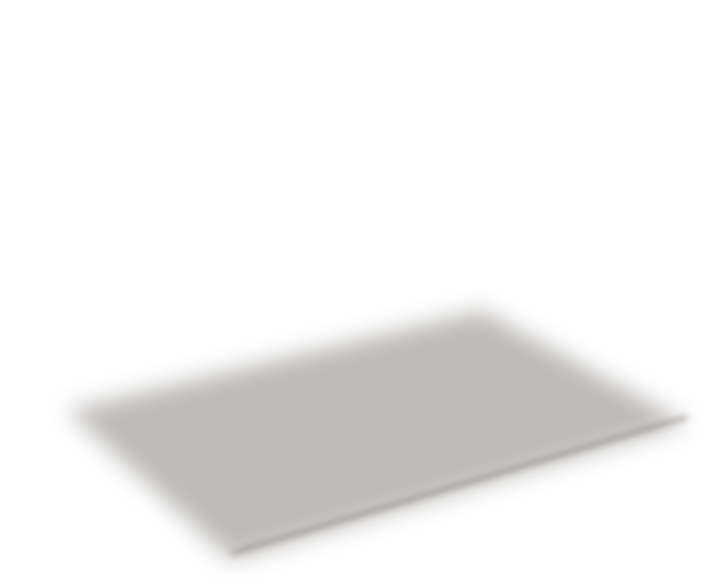
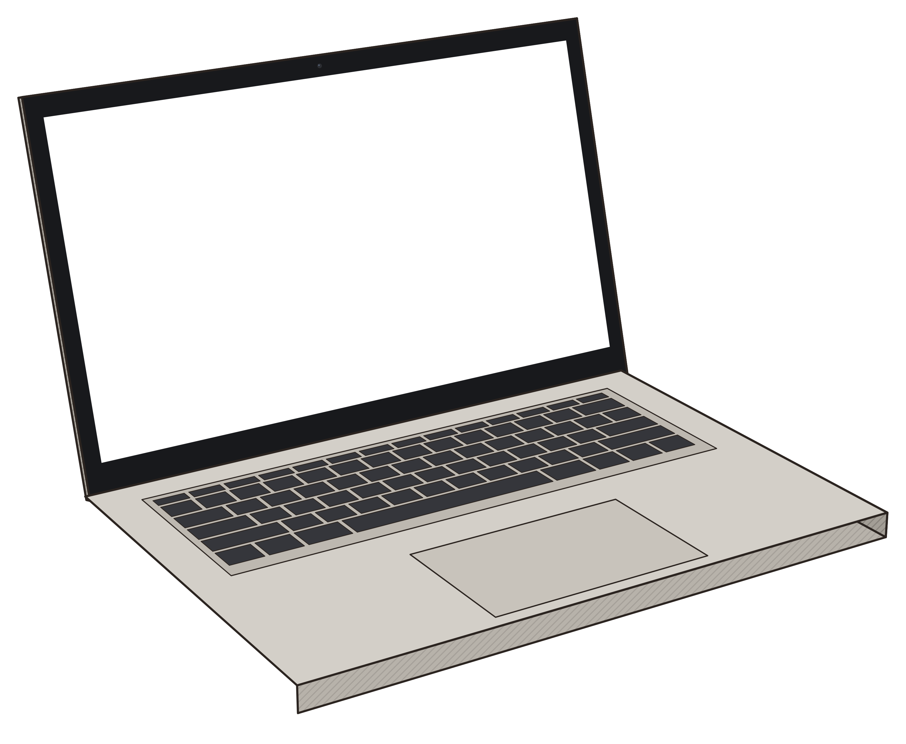
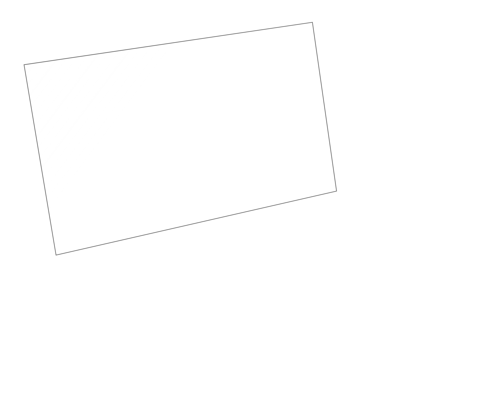

# Laptop mockup for series 3 "AI from Zero" (3D Artist, 2026-10-02)

A clean, logo-free laptop in the same flat ink look as Aurora (warm silver body, black bezel, light pencil hatching on the sides). The screen is a **hole**, so you put the real screenshot under it. Made for the Laptop Desk Zoom card (`../../laptop-desk-zoom/style.md`).

## Three angles
| View | Use | PNG size | Screen |
|---|---|---|---|
| `front` | straight-on, for punch-ins and step shots | 2339 x 1907 | a plain rectangle, exactly **1920 x 1080** at x 209, y 130, so a 1920x1080 screenshot sits 1:1, pixel-sharp |
| `hero` | 3/4 view from the right (Aurora stands on the left) | 2954 x 2427 | perspective, 4 corners in `laptop.json` |
| `hero-left` | the mirror, 3/4 from the left (Aurora on the right) | 2954 x 2427 | perspective, 4 corners in `laptop.json` |

## Layers per view (all the same size, stack them in this order)
1. `laptop-<view>-shadow.png`: soft contact shadow for the paper.
2. **your screenshot** (placed with the corners, see below).
3. `laptop-<view>-body.png`: the laptop with a transparent screen.
4. `laptop-<view>-glass.png`: a very faint glare plus the inner screen edge (optional, keeps the screenshot looking seated).

Also: `laptop-<view>-solid.png` has a grey screen (for timing only), and `laptop-<view>-mask.png` is white on the screen, black elsewhere.

## Putting a screenshot in
`laptop.json` gives each view's PNG size and screen corners in pixels, in this order: top-left, top-right, bottom-right, bottom-left. `laptop-screen.js` does the maths for you:
```html
<script src="laptop-screen.js"></script><script src="meta.js"></script>  <!-- meta.js = laptop.json as window.META -->
<div class="laptop" style="position:relative;width:2954px;height:2427px;transform:scale(.37);transform-origin:0 0">
  
  
  
  
</div>
<script>
  var shot = document.getElementById("shot");
  shot.decode().then(function () { LaptopScreen.placeScreen(shot, META.hero.corners); });
  // swap screens: change shot.src, then call placeScreen again. A <video> works the same way.
</script>
```
- Scale the whole `.laptop` box, never the layers on their own. For the wide shot (laptop about 85% of 1080 wide), use `scale(.4)` for front and `.37` for hero.
- For the front view you can skip the maths: put the screenshot at left 209.28, top 129.93, size 1920 x 1080.
- For punch-ins, scale the box up on `#ld-cam`. The front screen is 1:1 with a 1920 screenshot, so the 1.6 px rule from the style card holds up to about 1.6x on the screen.
- Screenshots should be 16:9 (1920 x 1080 is ideal). Any other size gets stretched to fill, so crop to 16:9 first.

## Check
`test-card-1920x1080.png` is a neutral grid with coloured corners (not a fake app). The previews in `previews/` show it on each angle at wide-shot size, and every corner lands in place. `laptop-sheet.jpg` shows all three angles side by side. `code/demo.html` is the working example.

## Remake or change it
`code/gen.js` builds a small 3D model and projects it. `node code/run.mjs <outdir>` (Playwright) writes every layer and `laptop.json`. To change the angle, edit `yaw`, `pitch` and `lid` in `run.mjs`. Keep `lid` equal to `pitch` for the front view, so the screen stays a perfect rectangle.
